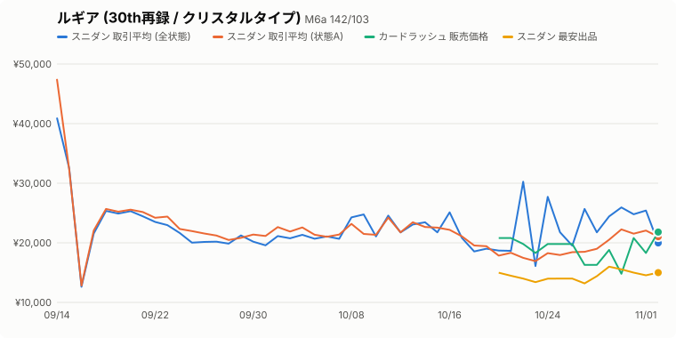

# ポケカ相場トラッカー

登録したカードの相場を GitHub Actions で毎日 (09:17 JST) 記録し、チャートを更新します。

- カードの登録: `cards.json` に追記 (Claude に「〇〇を登録して」と頼めば追記します)
- 登録時はスニダンの取引履歴から **発売日以降の全期間** を自動で遡って記録します
- カードラッシュ販売価格・スニダン最安出品は履歴が取れないため、登録日以降の記録です
- 生データ: `data/<id>.json`

## ルギア (30th再録 / クリスタルタイプ) (M6a 142/103)

拡張パック「30th CELEBRATION」 / 発売日 2026-09-16 / 最終更新 2026-11-01T14:58:41+09:00

| 指標 | 最新 | 日付 | 7日前比 | 30日前比 |
|---|---:|---|---:|---:|
| スニダン 取引平均 (全状態) | ¥26,666 | 2026-11-01 | +23.0% | +26.2% |
| スニダン 取引平均 (状態A) | ¥22,677 | 2026-11-01 | +25.9% | +0.2% |
| カードラッシュ 販売価格 | ¥18,300 | 2026-11-01 | -7.6% | - |
| スニダン 最安出品 | ¥14,555 | 2026-11-01 | +4.0% | - |
| スニダン 取引平均 (PSA10) | ¥160,999 | 2026-11-01 | +7.3% | - |
